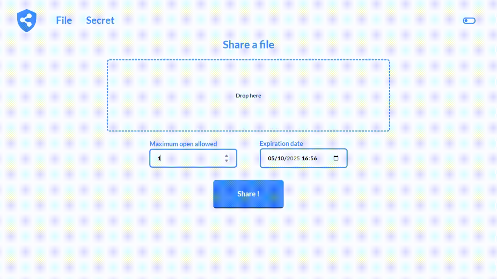

<div align="center">


# Share

**:octocat: [Github](https://github.com/ggtrd/share) &nbsp; &nbsp; 🐳 [Docker Hub](https://hub.docker.com/r/ggtrd/share)** \
**🚀 [Demo](https://share-lt4u.onrender.com)** *(wait for Render to instanciate it)*

Share is a secure web service designed to safely **transfer passwords**, **rich text**, **code snippets**, and **large files**.
<br>
➡️ Simply **paste** your content or upload a file, generate a secure **link**, and **deliver** it safely to your recipient !

</div>

## Features

* Securely send:
	* Passwords
	* Rich text
	* Code snippets
	* Large files (to bypass email provider attachments size limitation)
* Send simple one-clicks links to your recipient (basic links and passwords supported too)
* Automatic self-destruction
* Automatic strong password generation
* Fully customizable (logo and colors)
* Responsive interface 
* No account required
* Self-hosted solution
* CLI available for administrative tasks
* Share passwords are protected using OpenPGP encryption ([GopenPGP](https://gopenpgp.org/) & [OpenPGP.js](https://openpgpjs.org/))

**Tips** \
➡️ Share integrates seamlessly with reverse proxy authentication. For example, you can allow internal-only share creation while keeping unlock pages publicly accessible.
See the [example below](#reverse-proxy-example).

<br>

<div align="center">
	
	<br>
</div>


## Install from sources
* Install sources
	```
	git clone git@github.com:ggtrd/share.git \
	&& cd share \
	&& go mod tidy \
	&& go build
	```
* Initialize database
	```
	./share init
	```
* Start
	```
	./share web
	```

<br>

## Install with Docker
* Get `docker-compose.yml`
	```
	curl -O https://raw.githubusercontent.com/ggtrd/share/refs/heads/main/docker-compose.yml
	```
* Get `.env`
	```
	curl https://raw.githubusercontent.com/ggtrd/share/refs/heads/main/.env.example -o .env
	```
* Fill `.env` according to your needs
* Start
	```
	docker compose up -d
	```

<br>

## Use the CLI
> If run with Docker:
> `docker exec -it <container> sh`

```
./share help
```

<br>

## Customization

<div align="center">
	
	<br>
	<br>
</div>

> Customizations are handled within ```/static/custom``` directory. \
> A default mount point is configured in [docker-compose.yml](https://raw.githubusercontent.com/ggtrd/share/refs/heads/main/docker-compose.yml). \
> CSS overwrites must be placed in `/static/custom/theme.css` file.

### Logo

* Drop an image at `/static/custom/logo.png` or `/static/custom/logo.svg`
* (optional) drop a darkmode image at `/static/custom/logo-darkmode.png` or `/static/custom/logo-darkmode.svg`
* Overwrite logo size

```static/custom/theme.css
:root {
    --logo-height: 60px;
}
```

### Color

* Overwrite color
  > A color theme will be automatically calculated from this color

```static/custom/theme.css
:root {
    --color: #4cd137;
}
```

<br>

## Advanced
### Instance details
Details (such as version) are available at URL/about

### Reverse proxy example
> Apache HTTP Server with authentication on share creation

```
sudo a2enmod ssl proxy proxy_http
```

```
/etc/apache2/sites-available/001-share.conf
```

```
ServerName share.<domain>

<VirtualHost *:80>
        Redirect permanent / https://share.<domain>
</VirtualHost>

<VirtualHost *:443>
	SSLEngine on
	SSLCertificateFile      /etc/ssl/certs/<cert>.pem
	SSLCertificateKeyFile   /etc/ssl/private/<cert>.key

	# Allow everyone to get /share (= unlock share page)
	<Location "/share">
		AuthType none
		Satisfy any
	</Location>

	# Allow everyone to get /static (= style, images and JS files)
	<Location "/static">
		AuthType none
		Satisfy any
	</Location>

	# Require an authentication for everything else like /secret and /files (= create shares)
	# The authentication can be anything (basic auth, OIDC etc...)
	<Location "/">
		AuthType Basic
		AuthUserFile /etc/apache2/.htpasswd
		Require valid-user
	</Location>

	ProxyPreserveHost On
	ProxyRequests On
	ProxyPass / http://0.0.0.0:8080/
	ProxyPassReverse / http://0.0.0.0:8080/
</VirtualHost>
```

```
sudo a2ensite 001-share.conf
```

<br>

## Disclaimer

OpenPGP is used to cipher the password of a share when unlocking. It doesn't cipher anything else (like file download for example), please consider using HTTPS with a TLS certificate.

<br>

## License

This project is licensed under the MIT License. See the [LICENSE file](https://github.com/ggtrd/share/blob/main/LICENSE.md) for details.
